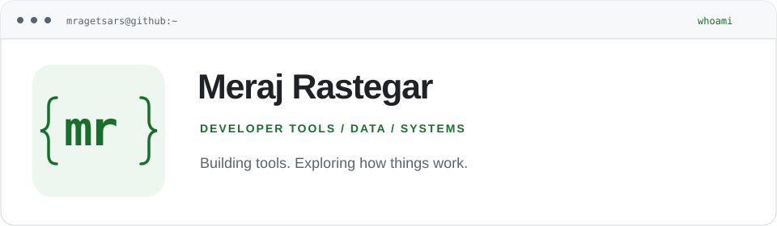

<picture>
  <source media="(prefers-color-scheme: dark)" srcset="assets/profile-neofetch-dark.svg">
  
</picture>

# Meraj Rastegar

<!-- PROFILE:START -->
**Computer Engineering Student · University of Tehran · Tehran, Iran**

[Explore my repositories](https://github.com/mragetsars?tab=repositories) · [Telegram](https://t.me/mragetsars_bot)
<!-- PROFILE:END -->

I build developer tools and explore data, intelligent systems, and computer architecture through practical and academic projects. My work spans Persian/English document publishing, machine learning pipelines, compilers, and processor design.

## Selected work

Some course projects are collaborative; each repository documents its scope and contributors.

<!-- PROJECTS:START -->
- **[Mardas Folio](https://github.com/mragetsars/Mardas-Folio)** — A Python-based Markdown-to-PDF publishing tool for Persian, English, and mixed RTL/LTR technical documents, with CLI, browser-based Studio, Book Mode, citations, cross-references, and Chromium rendering.  
  Python · 3 stars · Last push: 2026-08-24

- **[NYC housing price pipeline](https://github.com/mragetsars/NYC-Redfin-Price-Prediction-Pipeline)** — Python data science and MLOps pipeline for NYC Redfin price prediction with Selenium, SQLite, gradient-boosting ensembles, Docker, and Kubernetes.  
  Python · Last push: 2026-08-02

- **[University Teaching Management System](https://github.com/mragetsars/University-Teaching-Management-System)** — University Teaching Management System (UTMS) is a terminal-and-web hybrid C++20 application designed to streamline university course management and academic social interactions.  
  C++ · Last push: 2026-05-23

- **[MOL compiler](https://github.com/mragetsars/MOL-Compiler-Labs)** — A four-phase educational compiler for the MOL language, covering parsing, AST construction, semantic analysis, and Jasmin/JVM code generation.  
  Java · Last push: 2026-07-27

- **[Persian sentiment analysis](https://github.com/mragetsars/SnappFood-Sentiment-CNN)** — A Python and Jupyter Notebook implementation of Persian SnappFood sentiment classification with PyTorch, including Persian preprocessing, FastText-compatible embeddings, CNN training, and test-set evaluation.  
  Jupyter Notebook · Last push: 2026-06-22

- **[Pipelined RISC-V processor](https://github.com/mragetsars/RISC-V-Pipeline-Processor)** — The Register Transfer Level (RTL) implementation of a Pipelined RISC-V Processor.  
  Verilog · Last push: 2026-02-06
<!-- PROJECTS:END -->

## What I work with

| Area | Languages and tools used in my projects |
| :--- | :--- |
| Applications & systems | C, C++, Java, Python · SFML, Linux, Git |
| Data & machine learning | Python, SQL · PyTorch, scikit-learn, Jupyter, SQLite, PostgreSQL |
| Computer architecture | Verilog, assembly · RISC-V, MIPS, ModelSim |

## Around my GitHub

<!-- ACTIVITY:START -->
**33 public repositories** · **28 followers** · **4 stars received**

Stars received are counted across my 31 public non-fork project repositories (excluding this profile repository).

**More projects with recent pushes**

- [TETRIS](https://github.com/mragetsars/TETRIS) — 2026-07-07
- [Stardew Valley Mini Game](https://github.com/mragetsars/Stardew-Valley-Mini-Game) — 2026-07-06
- [Deep Learning Workflows for Data Science](https://github.com/mragetsars/Deep-Learning-Workflows-for-Data-Science) — 2026-06-25
<!-- ACTIVITY:END -->

فارسی · دربارهٔ پروژه‌ها

روی ابزارهای توسعه، پردازش داده و یادگیری ماشین کار می‌کنم و در پروژه‌های دانشگاهی به سراغ کامپایلرها، سیستم‌عامل و معماری کامپیوتر می‌روم. پروژهٔ Mardas Folio را برای نگارش Markdown و تولید PDF فارسی، انگلیسی و ترکیبی توسعه می‌دهم.

نمونه‌کارهای بالا از مخازن عمومی من انتخاب شده‌اند؛ معرفی هر پروژه و اطلاعات فعالیت آن از GitHub به‌روز می‌شود.

---

<!-- UPDATED:START -->
Public GitHub data refreshed: 2026-09-27 (UTC). Scheduled daily · repository descriptions, primary languages, stars and push dates update automatically. [Refresh status](https://github.com/mragetsars/mragetsars/actions/workflows/update-profile.yml).
<!-- UPDATED:END -->
